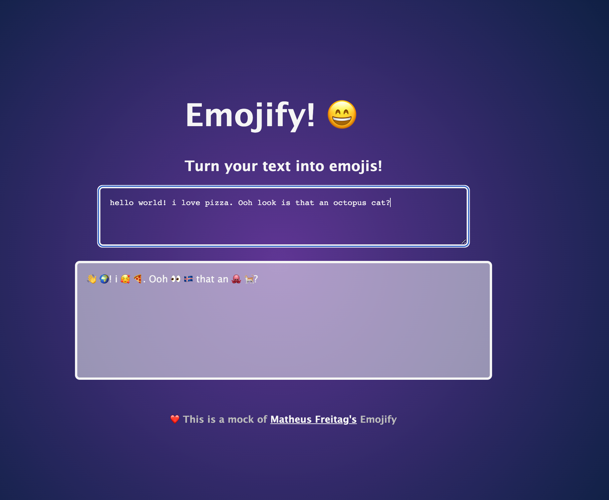

# Emojify
---

## Description 
An app that translates your words into emoji's

## Languages, Libraries & Frameworks
* React
* JavaScript 
* CSS
* HTML
* EmojiLib

## Setup 
1. Clone the repository to a local directory
2. cd into the directory and install the dependencies `npm install`
2. Start the dev server run `npm start`
3. run `npm run build` or `yarn build` to build the app for production

## Screenshots

## Live Demo 
https://deluxe-moxie-842c48.netlify.app/

## Usage & Details 
This app converts any sentences and words you type into the inputfield into related emoji's. 